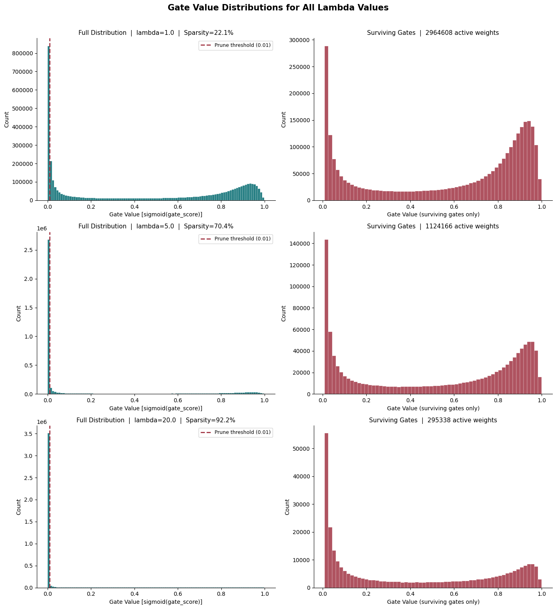

# Self-Pruning Neural Network - Report

**Author:** Malavika.A
**Dataset:** CIFAR-10 | **Framework:** PyTorch

---

## 1. Why L1 Penalty on Sigmoid Gates Encourages Sparsity

Each weight in the network is associated with a learnable scalar called `gate_score`. This is converted to a gate value using the Sigmoid function:

```
gate = sigmoid(gate_score)   ∈ (0, 1)
```

The sparsity loss is the **mean of all gate values** (L1 norm). Adding this to the total loss creates a constant pressure to reduce every gate toward zero:

| Penalty | Gradient | Effect |
|:-------:|:--------:|:------:|
| L2: `g²` | `2g` → shrinks as g → 0 | Gates get small but never reach exactly 0 |
| L1: `|g|` | `±1` constant | Constant push toward 0 regardless of current value |

Because `sigmoid(gate_score) > 0` always, the L1 norm equals the plain sum - no absolute value needed. This means:

- Gates **not needed** for classification: sparsity gradient dominates → gate_score → −∞ → gate ≈ 0 → weight removed.
- Gates that **are needed**: classification loss gradient pushes back → gate stays non-zero → weight survives.

An additional bimodal regularizer term `gate × (1 − gate)` is also included in the sparsity loss. This term is maximized at gate = 0.5 and minimized at gate = 0 or gate = 1, which forces gates to commit to a binary decision - either fully pruned (0) or fully active (1). The result is a clear bimodal gate distribution: a dominant spike at 0 (pruned weights) and a surviving cluster near 1 (essential weights). This is the same principle as LASSO regression in classical statistics.

---

## 2. Results

| Lambda (λ) | Test Accuracy | Sparsity Level (%) |
|:----------:|:-------------:|:------------------:|
| 1.0 (Low)    | 63.27%        | 22.06%             |
| 5.0 (Medium) | 61.69%        | 70.45%             |
| 20.0 (High)  | 59.09%        | 92.24%             |

As λ increases, sparsity increases and accuracy slightly decreases - confirming the expected sparsity vs. accuracy trade-off. Notably, increasing λ from 1.0 to 20.0 removes an additional 70% of weights while only costing 4.18% in accuracy. At λ = 20.0, the network retains just 7.8% of its original weights yet still achieves 59.09% accuracy on CIFAR-10 - demonstrating that the vast majority of weights in a feed-forward network are redundant for classification.

---

## 3. Gate Distribution - All Lambda Values



The histogram shows results for all three lambda values. Each row contains two panels:

- **Left panel (Full Distribution):** A dominant spike near gate = 0 confirms that the L1 sparsity penalty successfully drives most gate values toward zero. The spike grows larger as lambda increases - at λ = 20.0, over 92% of all gates are below the pruning threshold of 0.01.

- **Right panel (Surviving Gates):** The gates that were not pruned cluster near gate values of 0.8–1.0, forming a clear second group away from zero. This **bimodal shape** - spike at 0 and cluster near 1, depicts successful self-pruning. The network made decisive binary-like decisions about each weight: either eliminate it (gate → 0) or keep it fully active (gate → 1). 

As lambda increases from 1.0 to 20.0, the surviving cluster shrinks in size but remains near gate = 1.0, confirming that the retained weights are the most essential connections for classification.
